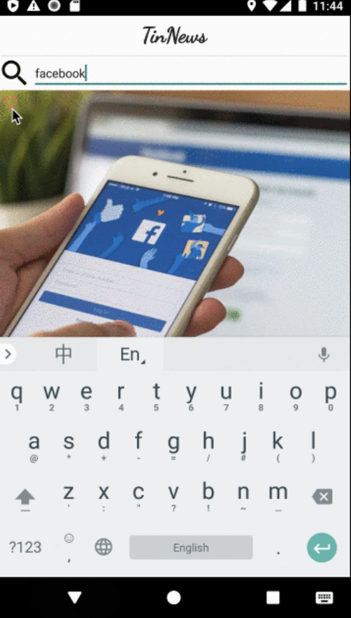

# TinNews: a Tinder-like News App

### LifeCycle

### NewsAPI

[https://newsapi.org/](https://newsapi.org/)

### MVVM pattern

Today we will follow Android recommended architecture pattern MVVM to structure our code: We will create a Repository as an intermediate container for providing data; The network requests are hidden behind the Repository; We will build ViewModel classes and use LiveData to provide updates for the future UI views.
App architecture
So, have you heard of ... `MVC`, `MVP`, `MVI`, `VIPER`, `MVVM` or `VIPER`?

Do you need one? Not necessarily. Some popular apps scale well without complicated architectures, e.g. (Instagram). On the other end some apps have heavy architectures, e.g. (Uber). There's no right or wrong in each. It comes down to different philosophies. A simple architecture means lean and lightweight both in terms of app performance and app development cycles. A heavy architecture supports more complicated hierarchies and a bigger development team.
We don't need to go into the details of each pattern, the key focus is a simple idea "Separation of Concerns":
Support for more complicated business logic.

Support for more complicated business logic.
Lower maintenance cost.
Scaling for team collaborations.
Better testability and Isolation.

Android provides `MVVM` support built into the ecosystem with Jetpack. It's a "opinionated" package, vs iOS which has no preference on architecture choices in most cases. Android makes the effort of adopting `MVVM` very easily. So while your app would be fine without an architecture at an early stage, it's no-brainer to get the architecture right from the beginning. The package also solves other tricky issues like lifecycle handling conveniently.
`MVVM` stands for Model-View-ViewModel, I suggest this good detailed explanation. On a high level:

### Local Database with Room

Overview
Many apps persist data locally. The most popular example would be WeChat. Your chat history won’t be synced to the cloud. Instead, the chat history is kept locally. Today, we will be working on saving the favorite articles to the local database with an ORM framework Room.

Room Introduction
You have seen Hibernate in the Spring MVC framework. Room is a similar annotation-based ORM solution for SQLite on Android. You can save lots of time and effort writing error-prone raw SQL queries by using a much more modern Object-oriented accessors.
But why do you need Room or SQLite on mobile?

Apps doesn’t need network access. (Not many these days)

Apps need to support offline mode. Trello

Hybrid apps consume both network and local generated structure data.

the local database on Android was really bad with direct SQL queries and manual parsing. Room has the following concepts:
Database contains the database holder and serves as the main access point for the underlying connection to your app’s persisted, relational data.
Entity represents a table within the database.
DAO contains the methods used for accessing the database.

### Repository Integration

How does the database work with the rest of the MVVM architecture?

### Multiple Thread

How to handle those heavy works?

Main Thread: All UI Interaction should stay in the UI Thread, eg: TextView.setText(), RecyclerView.notifyDataSetChange()
Background Thread: All the heavy works have to be moved to Background thread, when execution is done, move the data back to UI thread by Handler and consume.

More info About Thread Handling
AsyncTask enables proper and easy use of the UI thread. This class allows you to perform background operations and publish results on the UI thread without having to manipulate threads and/or handlers.
